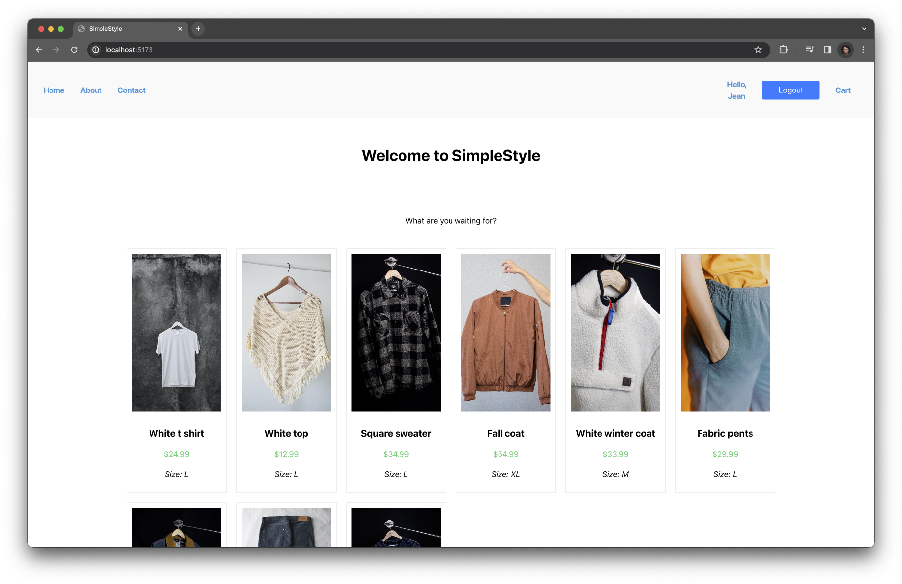

# Clothing Website

This is a clothing website project that allows users to display and browse clothing items. The project is built using Firebase, FastAPI, and React. Clothing images are provided by Unsplash.

## Table of Contents

- [Technologies Used](#technologies-used)
- [Features](#features)
- [Project Status](#project-status)
- [Contact](#contact)

## Technologies Used

- **Firebase**: Used for authentication, database, and hosting.
- **FastAPI**: Backend framework for building RESTful APIs.
- **React**: Frontend library for building user interfaces.
- **Unsplash**: Used for clothing images.

## Features

- Display a grid of clothing items.
- User authentication for personalized experiences.
- Backend API for managing clothing data.
- Integration with Unsplash for high-quality clothing images.

## Project Status
The project is currently in active development, with a focus on refining core functionalities. User authentication, ensuring secure account creation and login, has been fully implemented. Users can seamlessly browse a visually appealing grid of clothing items, sourced from Unsplash, showcasing the successful implementation of item display. Continuous backend optimization efforts are underway to ensure robustness and scalability.

## Contact

- **LinkedIn**: [jeanmichelbb](https://www.linkedin.com/in/jeanmichelbb/)
- **Website**: [my Personal Website](https://jeanmichelbb.github.io/)
